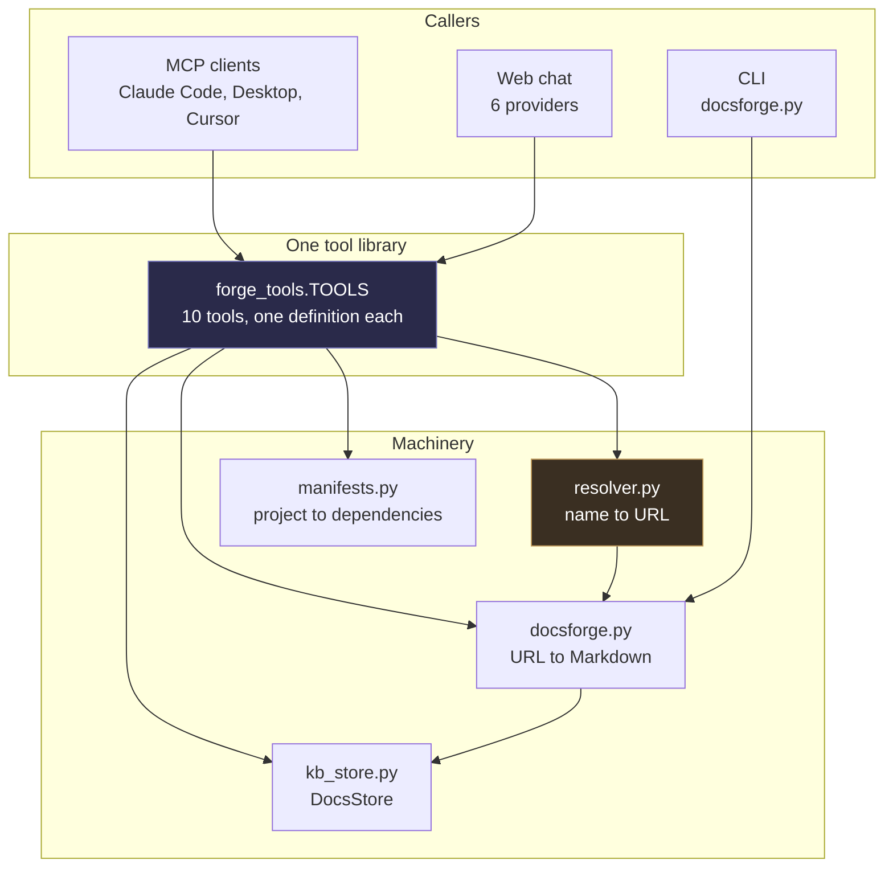
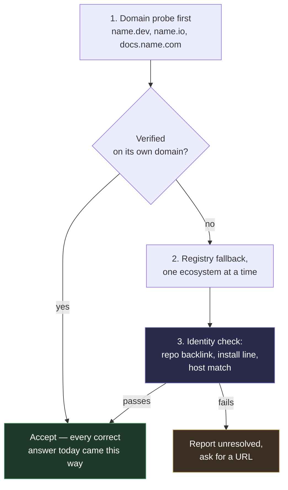

# DocsForge — audit

**First run:** 17 August 2026 · **Re-verified:** 20 August 2026 against `5b320df`
· **Method:** every claim below was executed, not read off the source.

> **Re-verification note (20 August).** Every finding below was re-run. All of
> them still reproduce, including the three wrong resolutions and their
> `verified: true` flags. One diagnosis was **wrong and has been corrected**:
> F9's cause is not that the harvester cannot tell an index from a full dump —
> it can, and does. See F9 for what actually happens. Two tables have been
> completed with measurements that were previously marked "not measured", and
> the total recoverable figure is far larger than first reported.

---

## Verdict in one paragraph

The pipeline from **a URL to stored, searchable, versioned documentation is
solid** — that half is well built, well tested and doing real work (703 pages of
Effect, 109 of Pydantic across two versions, ranked full-text search returning
genuinely relevant snippets). The weakness is not that DocsForge fails; it is
that **it fails confidently, and labels the failures as checked.** Of eight
technologies resolved live today, three landed on the wrong project and **all
three were marked `verified`**. Separately, seven stored technologies contain a
table of contents rather than documentation — 0.81% of the text that was
actually available, 19 million characters missing — and every one is marked
`complete`. The verification and
completeness signals that exist precisely to prevent silent wrong answers are
the signals that are wrong. That is the finding this audit is really about.

---

## 1. What DocsForge is

A standalone MCP server that gives any AI model documentation for technology it
was never trained on. A model hits an unfamiliar import, calls DocsForge with
the name, and gets back real documentation harvested from the real site — rather
than reconstructing something from stale training data.

Ten tools, one library, three surfaces:



`mcp_server.py` does not define tools. It **generates** them from
`forge_tools.TOOLS` by translating each JSON Schema into a synthesised Python
signature the SDK can read. That is worth keeping: the two surfaces previously
drifted badly — four tools existed in the library and simply were not exposed
over MCP, and `max_pages` was declared `ge=1, le=200` in the MCP copy while the
harvester treats `0` as unlimited, so no MCP client could request a full
harvest. Twelve tests in `test_mcp.py` now hold the generated surface against
its source.

**Verified today:** `python mcp_server.py --list` prints all ten tools.

---

## 2. What works

### 2.1 URL → Markdown (`docsforge.py`, 1,059 lines)

The oldest and strongest part. `detect_source()` picks a strategy, then a
handler renders to Markdown:

| Strategy | Trigger | Notes |
|---|---|---|
| `llms_txt` | a published `llms.txt` | The site describing itself for machines — nothing beats it |
| `openapi` | OpenAPI/Swagger JSON or YAML | Renders operations, parameters, schemas as tables |
| `sitemap` | `sitemap.xml`, nested sitemaps followed | Bounded recursion |
| `github` | a repository URL | README + `docs/` |
| `raw_text` | plain text | |
| `html` | fallback | Crawls same-host links inside a scope |

Two details that matter more than they look:

- **`docs_scope()`** pins a crawl to the documentation root. Without it a crawl
  starting at an Effect docs page swallowed `/podcast`, and the model
  summarised a podcast feed as though it were the library. This is the single
  most valuable function in the file.
- **Version labelling is verified, not assumed.** `harvest()` reads a version
  from the URL path, then checks the pages actually came back carrying it, and
  falls back to a harvest date if not. This was added because Pydantic 2.11 and
  1.10 harvested **byte-identical** — both had silently been served the
  site-wide `llms.txt`. A store that cheerfully files two different versions of
  the same bytes is worse than one with no versions at all.

**Verified today:** 57 harvest tests + 43 core tests pass.

### 2.2 DocsStore (`kb_store.py`, 716 lines)

Three levels — **technology → version → page** — behind one `Store` protocol
with two implementations.

| | Postgres | Files |
|---|---|---|
| Search | `websearch_to_tsquery` + `ts_rank`, GIN index on a generated `tsvector` | substring, unranked |
| Snippets | `ts_headline` with `«…»` markers | none |
| Bulk load | `COPY … FROM STDIN` | file write |
| Role | production | fallback |

The fallback is not decorative. A slow-starting database used to make DocsStore
appear permanently empty, because the file store was chosen once at boot and
cached forever. It now records `wanted_dsn` and retries Postgres after 15
seconds, so a database that arrives late is picked up rather than ignored for
the life of the process.

**Verified today**, against the live database:

```
18 technologies stored
  effect     703 pages   6,322,993 chars   v3
  pydantic   109 pages   1,414,402 chars   1.10 + 2.11
  16 others    1 page each   (see F9 — seven of these are indexes, not docs)
```

Ranked search, run live for `"retry policy"`:

```
- effect v3 · page 19: Retrying
    …how to define **retry** **policies** using schedules, which dictate when…
- effect v3 · page 123: Effect vs fp-ts
- effect v3 · page 43:  Examples
```

Correct ranking, correct highlighting, sub-second. This part works.

### 2.3 Project manifests (`manifests.py`, 226 lines)

Parses `package.json`, `pyproject.toml` (PEP 621 *and* Poetry),
`requirements.txt`, `Cargo.toml`, `go.mod`. Bounded walk, `node_modules` and
friends skipped, nothing imported or evaluated — manifests are read as data.

**Verified today:** `scan_project(".")` on this repository listed all 19
dependencies with pinned versions and correctly identified `pydantic` as the
one already stored.

### 2.4 Name normalisation

`normalise()` strips prose dressing — `Effect.ts`, `effect-ts` and `effect` all
reduce to `effect` — and `stored_name()` matches exact, then normalised, then
unique-prefix, refusing ambiguous prefixes rather than guessing. `learn_technology`
files under the canonical form, so calling it as `"Effect.ts"` after `"effect"`
finds the existing copy instead of re-crawling 703 pages into a duplicate.

**Verified previously end-to-end:** `learn_technology("valibot")` with no URL →
npm → `valibot.dev/llms.txt` → verified → harvested in 4s; a second call spelled
`"Valibot"` fetched nothing.

---

## 3. What does not work

🔴 wrong answers delivered as correct · 🟠 real limitation, visible when it bites
· F1–F8 concern resolution and run roughly in damage order. **F9 was found last
and is the single highest-payoff fix on the list** — it is numbered last only
because the numbers are referenced elsewhere and renumbering would break them.

### F1 — Verification confirms the *name*, not the *project* 🔴

The whole safety argument for resolving by name rests on `verify()`. It fetches
the candidate and counts how many times the normalised name appears in the
stripped body; three or more and the candidate is `verified`.

That test cannot distinguish a project from an unrelated project with the same
name. Measured live:

| Asked for | Resolved to | `verified` | Reason given |
|---|---|---|---|
| `terraform` | `github.com/sintaxi/terraform#readme` | **true** | "names 'terraform' 4 times" |
| `kubernetes` | `github.com/kubernetes-client/python` | **true** | "names 'kubernetes' 5 times" |
| `htmx` | `docs.rs/htmx` | **true** | "names 'htmx' 8 times" |

None of these is the technology anyone means. HashiCorp Terraform is not
`sintaxi/terraform` (an unrelated static-site tool). Kubernetes is not its
Python client library. htmx is not a Rust crate. Every one passed.

**Why it fails:** a page about *any* project called X mentions X constantly.
Mention-counting measures topic, not identity.

**What would actually work** is checking identity signals the registry already
handed us: does the candidate page link back to the repository the registry
named? Does its install line name the same package in the same ecosystem
(`npm i htmx` vs `cargo add htmx`)? Is the host the project's own domain rather
than a code forge? Those distinguish projects. A word count does not.

### F2 — Candidate ranking crosses ecosystems 🔴

Candidates from every registry are pooled and sorted by confidence alone. A
`documentation` field scores 0.92 regardless of which registry it came from, so
for `htmx` the crates.io entry (0.92) outranked the npm homepage (0.55) — and
npm is where the real htmx lives. Same shape for `astro`, which tried a Rust
crate first.

The ecosystem is only corrected *after* a winner verifies, which is too late:
by then the wrong ecosystem has already won.

### F3 — The probe accepts empty pages, and this loses to marketing 🟠

For `astro`, the probe **found the correct documentation root** —
`https://docs.astro.build/` — and then verification rejected it, while the
marketing homepage `astro.build` won with 60 mentions.

Measured cause:

```
https://docs.astro.build/    80 bytes    3 chars of text    0 mentions
https://astro.build      40,000 bytes  6,448 chars of text  60 mentions
```

`docs.astro.build/` returns an 80-byte redirect shell. `probe_docs_root()`
accepts a candidate on HTTP 200 plus an HTML content-type and nothing else, so
an empty stub enters the pool at 0.70 confidence, fails verification, and hands
the win to the marketing page. The right answer was found and then discarded.

Needs a minimum-content floor and meta-refresh / client-redirect following.

### F4 — The forge guard is exact-host 🟠

`FORGES` is matched exactly, so subdomains slip past:

```
is_forge("https://gist.github.com/…")          -> False
is_forge("https://raw.githubusercontent.com/…") -> False
```

Live consequence: resolving `htmx` produced **`https://gist.github.com/llms.txt`
at 0.95 confidence** — the highest-scoring candidate of the entire run. It was
rejected only by luck, because GitHub's own `llms.txt` happens not to say
"htmx". Ask about a word GitHub's file does contain and it wins.

### F5 — `"latest"` means most-recently-harvested, not newest 🔴

Live, right now:

```
pydantic versions stored : 1.10 (24 pages), 2.11 (85 pages)
read_knowledge_base("pydantic")  ->  1.10
```

A model asking for Pydantic docs with no version gets **1.10** — because it was
harvested at 18:26 and 2.11 earlier. This repository's own `requirements.txt`
pins `pydantic>=2.0`.

This is exactly the contradiction the three-level versioned store was built to
prevent, reintroduced at the very last step. And `scan_project` reports
`pydantic … stored as **pydantic**` without noticing the mismatch:
`manifests.doc_versions()` exists and computes the right candidate labels, but
nothing calls it when deciding what to hand back.

### F6 — Multi-word technologies do not resolve 🟠

`cloudflare workers` → unresolved in 1.6s. No registry has that name, and there
is no other path. The failure is *honest* — it reports unresolved rather than
inventing something, which is the designed behaviour and the right one — but a
large class of real technologies (cloud platforms, databases, protocols,
anything with a space in its name) is simply unreachable.

### F7 — `learn_technology` blocks for minutes 🟠

A 703-page harvest takes roughly 12 minutes. The tool call blocks for all of it,
which exceeds typical MCP client timeouts. The most valuable tool in the product
is the one most likely to time out in the client that calls it.

### F8 — The Postgres backend is unexercised by default 🟠

All 22 skipped tests are Postgres, gated behind `DOCSFORGE_TEST_DB`:

```
284 passed, 22 skipped in 25.01s
```

The default run therefore tests the **fallback** store thoroughly and the
**production** store not at all. The Postgres path holds the schema migration,
the `tsvector` search, `ts_headline` snippets and the `COPY` bulk load — the
parts most likely to break and least likely to break visibly.

### F9 — The resolver's success disables the extractor's correct behaviour 🔴

Sixteen of eighteen technologies hold exactly one page. Some are legitimate —
`zod` is a single 266 KB `llms.txt` that really is the whole thing. But the
`llms.txt` convention has two shapes:

- a **full dump** — the documentation itself (zod, stripe, convex)
- an **index** — a short link list that names a fuller file alongside it

Seven of the sixteen single-page technologies stored the index.

**The first version of this audit blamed the harvester for not telling the two
apart. That was wrong.** `detect_source()` already prefers `llms-full.txt` — it
probes for it *first*, at `docsforge.py:301`. Measured today, the same site
resolves three different ways depending only on the URL it is handed:

```
detect_source("https://ai-sdk.dev/llms.txt")           -> https://ai-sdk.dev/llms.txt        (2 KB index)
detect_source("https://ai-sdk.dev")                    -> https://ai-sdk.dev/llms-full.txt   (5.7 MB)
detect_source("https://ai-sdk.dev/docs/introduction")  -> https://ai-sdk.dev/llms-full.txt   (5.7 MB)
```

Given the bare domain, DocsForge gets it right. It only fails when handed the
`llms.txt` URL directly — because `docsforge.py:280` returns immediately on any
URL ending in `llms.txt`, and the probe that would have found the full file sits
*below* that early return and never executes.

And handing over exactly that URL is what the resolver does. `DOC_PATHS` in
`resolver.py:38` begins with `/llms.txt`, and a hit becomes a candidate at
**0.95 — the highest confidence the resolver can assign.** So:

> **The resolver finding an `llms.txt` is the very thing that stops the
> extractor from looking for the full one.** Two components, each correct alone,
> wrong in combination.

Measured cost, every figure fetched today:

| Technology | Stored | Full file available | Captured |
|---|---|---|---|
| `ai-sdk` | 2,216 | **5,756,477** | 0.04% |
| `prisma` | 7,086 | **4,961,636** | 0.14% |
| `nuxt` | 56,614 | **4,451,427** | 1.27% |
| `railway` | 70,612 | **2,398,306** | 2.94% |
| `svelte` | 1,673 | **1,181,307** | 0.14% |
| `hono` | 5,649 | **369,248** | 1.53% |
| `tanstack` | 11,592 | 11,595 | 99.97% — no real loss |

**155,442 characters stored against 19,129,996 available: 0.81%.** The missing
18.97 million characters are **more than twice the entire rest of the store**
(8.42 M today). Fixing this one bug takes DocsForge from 8.4 M to roughly
27.4 M characters — it more than triples the corpus without harvesting a single
new technology.

Every one of these is marked `complete: True`. The stored file for `hono` reads,
in full sentences, *"[Full Docs](https://hono.dev/llms-full.txt) Full
documentation of Hono"* — the answer is named inside the file stored instead of
it. A model answering Svelte questions from 1.6 KB of link list has no signal
that it is reading a table of contents.

**The corrected fix** is not "follow the link". It is: do not let a URL that
ends in `llms.txt` skip the sibling probe — and, underneath that, stop deciding
completeness without counting anything. See §6.

---

## 4. Resolution accuracy, measured

Eight names, live, today. No cache.

| Name | Resolved to | Time | Verdict |
|---|---|---|---|
| `fastapi` | `fastapi.tiangolo.com/` | 2.6s | ✅ correct |
| `vitest` | `vitest.dev/llms.txt` | 3.4s | ✅ correct |
| `deno` | `deno.com/docs` | 10.7s | ✅ correct |
| `astro` | `astro.build` | 5.0s | ⚠️ right project, marketing page — docs root was found and rejected (F3) |
| `htmx` | `docs.rs/htmx` | 3.1s | ❌ wrong ecosystem (F2) |
| `kubernetes` | `github.com/kubernetes-client/python` | 2.7s | ❌ client library, not the platform (F1) |
| `terraform` | `github.com/sintaxi/terraform#readme` | 3.1s | ❌ unrelated project (F1) |
| `cloudflare workers` | unresolved | 1.6s | ⚠️ honest failure (F6) |

**3 correct · 1 partial · 3 wrong · 1 honest failure.**

**Re-run on 20 August: identical.** Same three wrong projects, same three
`verified: true` flags, same reasons given. The only difference was `deno`,
which returned `docs.deno.com` rather than `deno.com/docs` — the same answer —
and took 24.5s instead of 10.7s.

The three wrong answers all carried `verified: true`. A wrong answer that
announces itself as verified is worse than no answer, because the caller has
been given a reason to stop checking.

Note the pattern in the failures: **every wrong answer came through a registry,
and two of the three landed on a code forge.** Meanwhile every correct answer
came from the project's own domain. That asymmetry is the single clearest
signal in the data, and section 6 is built on it.

---

## 5. Test coverage

306 tests. 284 pass, 22 skip, 25 seconds.

| File | Tests | Covers |
|---|---|---|
| `test_harvest.py` | 57 | scoping, versioning, crawl bounds |
| `test_kb_store.py` | 56 | both stores (**22 Postgres tests skipped by default**) |
| `test_docsforge.py` | 43 | detection and every handler |
| `test_app.py` | 42 | routes, SSE, caching headers |
| `test_providers.py` | 31 | the six chat providers |
| `test_learn.py` | 26 | `learn_technology`, `stored_name` |
| `test_resolver.py` | 23 | resolution chain, scoring, verification |
| `test_manifests.py` | 16 | five manifest formats |
| `test_mcp.py` | 12 | generated surface matches the library |

The gap is not in count, it is in kind: the resolver's 23 tests all use stubbed
fetchers, so they verify the *chain logic* and never the *outcomes*. Every
failure in section 4 passes the resolver test suite. Nothing in the repository
would tell you `terraform` resolves to the wrong project.

**A fixture of known-correct name → docs mappings, asserted against live
resolution, would have caught every single F1–F4 failure.** That is the highest
-value test to add, and it does not exist.

---

## 6. What to fix, in order



0. **Stop the `llms.txt` short-circuit** (F9). Do this first. `detect_source()`
   already prefers `llms-full.txt`; it is simply skipped when the URL already
   ends in `llms.txt`. Probing the sibling before accepting an index recovers
   **19.0 million characters** — more than twice the current store — from
   technologies DocsForge already believes it has stored completely. Nothing
   else here has that ratio of effort to payoff.
1. **Invert the spine — probe the domain before asking a registry.** Every
   correct answer in section 4 came from the project's own domain; every wrong
   one came through a registry. Registries answer the question "what package is
   called this", which is not the question being asked.
2. **Replace mention-counting with identity checks** (F1). Repository backlink,
   install-line ecosystem, host match. This is what makes resolution safe rather
   than merely usual.
3. **Add a live accuracy fixture** (§5). Without it, fixes 1 and 2 cannot be
   shown to have worked.
4. **Fix `latest`** (F5) — newest version, not newest harvest — and make
   `scan_project` use `doc_versions()` it already computes.
5. **Content floor on probes** (F3) and **suffix-matched forge guard** (F4).
   Both are a few lines and both currently cost correct answers.
6. **Make `learn_technology` non-blocking** (F7).
7. **Run the Postgres suite in CI** (F8).
8. **Then, and only then**, consider a web-search layer for F6. It is the only
   fix here that costs every user an API key, and it should not be used to paper
   over F1–F4 — a search engine feeding an unreliable verifier just produces
   wrong answers from a larger pool.

Items 0, 4 and 5 are together perhaps a day's work and fix the three defects
most likely to produce a confidently wrong answer today.

---

## 7. Summary

| Area | State |
|---|---|
| URL → Markdown | ✅ strong |
| Crawl scoping | ✅ strong |
| Version labelling at harvest | ✅ strong |
| DocsStore, ranked search | ✅ strong |
| MCP surface generation | ✅ strong |
| Manifest parsing | ✅ strong |
| Name normalisation | ✅ good |
| Name → URL resolution | ⚠️ 3 of 8 wrong, all marked verified |
| Verification | 🔴 does not distinguish projects |
| `llms.txt` index vs full dump | 🔴 index stored as complete; 7 technologies affected |
| Version selection on read | 🔴 returns most-recent harvest |
| Long harvests over MCP | 🟠 blocks past client timeouts |
| Postgres test coverage | 🟠 skipped by default |

The half of DocsForge that was hard to build is done and works. What remains is
small in code and large in consequence, and the three red rows share one shape:
**DocsForge reports confidence it has not earned.** A resolution that landed on
the wrong project says `verified`. A stored table of contents says `complete`. A
read with no version says `latest` and hands back the older one.

Each is individually minor and locally sensible. Together they mean the failure
mode of this product is not *"no answer"* — it is *"a wrong answer that looks
checked"*. That is the thing worth fixing, and it is worth fixing before any new
capability, because everything downstream is already good enough to make a wrong
answer look authoritative.
