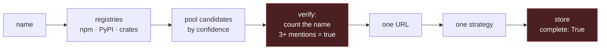
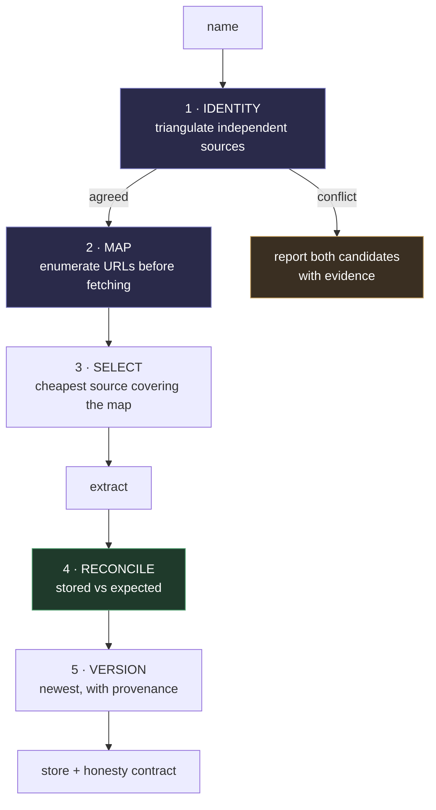

# Proposal: a documentation hub any model can trust

**Date:** 20 August 2026 · **Against:** `5b320df` · **Evidence:** [AUDIT.md](AUDIT.md)
**Status:** the harvest-and-store half is shipped and working. This proposal is
about the half that decides *what* to harvest and *whether it finished*.

> **Supersedes the previous proposal.** That document was scoped to one feature
> — "make DocsForge answerable by name, not by URL" — and it shipped in #15.
> Then the audit measured what shipped, and the result changes the plan rather
> than extending it. This is a rewrite, not a phase 6.

---

## 1. What DocsForge has to be

One sentence: **any AI model — LLM, SLM, anything — that meets a technology it
was never trained on can ask DocsForge by name and get that technology's real
documentation.**

That is the whole product. The model hits an unfamiliar import, an unfamiliar
CLI, an unfamiliar API, and instead of reconstructing something plausible from
stale training data it reads the actual current documentation.

For that to be worth building, three things have to be true of every answer:

| | |
|---|---|
| **Right project** | `terraform` means HashiCorp Terraform, not someone's static-site tool |
| **The whole thing** | not the table of contents, not the first 40 pages |
| **Right version** | Pydantic 2.11, not 1.10, when 2.11 is what is installed |

Today, measured, DocsForge fails all three — and reports success on all three.
That last clause is the actual problem. A tool that says "I don't know" is
usable. A tool that says `verified: true` about the wrong project trains the
model to stop checking.

---

## 2. Why the current design cannot get there

Not "has bugs". Cannot get there. The pipeline is:



Two stages that must exist are simply absent.

**There is no identity stage.** Registries answer *"what package is named X?"*
DocsForge is asking *"what is the technology X?"* Those are different
questions, and the gap between them is exactly where `terraform`, `kubernetes`
and `htmx` land on the wrong project. `verify()` does not close the gap: it
counts how often the name appears, and a page about *any* project called
terraform says "terraform" constantly. **Mention-counting measures topic, not
identity** — and it is the only thing standing between a caller and a wrong
answer.

**There is no enumeration stage.** Nothing in the pipeline ever computes how
many pages the documentation *has*. Without that number, "finished" and
"stopped" are the same event. `complete: True` is therefore not a finding, it
is a constant — and the audit found seven technologies where it is a lie.

Every failure in the audit is downstream of one of four questions the system
never properly asks:

| Question | Failures | Currently answered by |
|---|---|---|
| **Which project is this?** | F1, F2, F4, F6 | counting a word |
| **Where is its documentation?** | F3, F6 | first HTTP 200 |
| **How much of it is there?** | F9 | nothing at all |
| **Which version is this?** | F5 | whichever ran last |

Plus two operational: F7 (harvest blocks past client timeouts) and F8 (the
production store is untested by default).

### The one that reframes everything

F9's real cause, measured, is not what the first audit said:

```
detect_source("https://ai-sdk.dev/llms.txt")   -> keeps the 2 KB index
detect_source("https://ai-sdk.dev")            -> finds llms-full.txt, 5.7 MB
```

DocsForge **already prefers the full file**. `docsforge.py:280` returns early on
any URL ending in `llms.txt`, so the probe at `:301` that would have found the
full one never runs — and `resolver.py:38` hands over exactly that URL, scored
`0.95`, the highest confidence it can assign.

**The resolver succeeding is what makes the extractor fail.** Two components,
each correct in isolation, wrong in combination. No amount of care inside either
one would have caught it; only measuring the whole pipeline did.

Cost: **155,442 characters stored against 19,129,996 available — 0.81%.** The
missing 19 M is more than twice the entire rest of the store.

---

## 3. Do not plan around `llms.txt`

Before designing anything, one assumption had to be tested: *do sites just
publish their docs for us now?* Surveyed 24 real documentation sites today:

| | publishes `llms.txt` or `llms-full.txt` |
|---|---|
| Modern AI-era dev tools — ai-sdk, hono, svelte, bun, nuxt, prisma, vercel | **7 / 8** |
| Established & enterprise docs | **4 / 16** |

Nothing on Python, Django, PostgreSQL, Kubernetes, MDN, Go, Rust, FastAPI,
Spring, Laravel, Oracle — **or HashiCorp**. React and Node publish a 14 KB
index and no full file.

The inversion is the design constraint:

> **The sites that publish `llms.txt` are the ones that need us least.** A
> project shipping 5.7 MB of clean Markdown is already readable by any model.
> The hard, valuable cases — Kubernetes, Terraform, Django, Spring, Oracle —
> publish nothing, and there the crawler is the only path.

So the convention is an optimisation to exploit, never a foundation. The
crawler has to be genuinely good.

---

## 4. The architecture

Five stages. Two of them are new, and they are the two the audit says are
missing.



### 4.1 Identity — triangulate, do not count

The audit noticed that every correct answer came from the project's own domain
and every wrong one came through a registry. "Domain first" is the right
behaviour, but it is a heuristic that happened to work on eight names. The
principle underneath it is stronger:

> **Identity is established when independent sources name each other.**

For `hono`: npm gives homepage `hono.dev` and repository `github.com/honojs/hono`;
`hono.dev` links back to that same repository; the install line on the page reads
`npm create hono@latest`. Three independent artefacts agree. The loop closes.

For `terraform`: npm gives repository `github.com/sintaxi/terraform`, and that
loop closes too — but `terraform.io` resolves to HashiCorp, a *different*
project. **Two identities, in conflict.** That conflict is information, and it
is currently thrown away.

Signals, each independently checkable, none requiring a key:

| Signal | What it establishes |
|---|---|
| Host is `<name>.{dev,io,org,com}` or `docs.<name>.*` | the project owns the name |
| Page links back to the repository the registry named | site and registry agree |
| Install line matches the registry's ecosystem — `npm i htmx` vs `cargo add htmx` | right ecosystem |
| Registry's own homepage / repository / documentation fields agree | internally consistent |
| Host is a code forge, `docs.rs`, or a shared docs host | **negative** — third-party surface |

Rules:

1. **`verified: true` requires at least two independent signals.** A word count
   is not a signal.
2. **When a live project domain conflicts with a registry entry, the domain
   wins** — owning `<name>.org` is a far stronger claim on a bare name than
   being *a* package called that in *one* namespaced, first-come registry.
3. **Conflicts are reported, not silently resolved.** Return both with evidence.

Checked against the three wrong answers: `terraform.io`, `kubernetes.io` and
`htmx.org` all exist and all conflict with the registry hit. All three become
correct, or at minimum become honest.

### 4.2 Map — enumerate before fetching

The missing organ. Before downloading any content, build a URL set from
everything cheap:

- `llms.txt` — parsed **as an index**, for the links inside it
- `llms-full.txt` — `HEAD` it, record whether it exists and how big
- `sitemap.xml`, sitemap indexes, and any sitemap declared in `robots.txt`
- a scoped link crawl, as fallback only

Output: `expected: N`, which sources produced it, and any full dump found. A
handful of requests, amortised across a harvest that will fetch hundreds of
pages.

This is the idea worth taking from Firecrawl — its `/map` is a separate call
from its `/scrape`, and that separation is precisely what DocsForge lacks. We
need the shape, not the dependency (§6).

### 4.3 Select — cheapest source that covers the map

Full dump if one exists and is substantial · else the sitemap pages within docs
scope · else a scoped crawl. Record which and why.

Note this kills F9 *structurally* rather than by special case: with a map in
hand, an `llms.txt` index is self-evidently an index — it is a list of 40 links
— so either the full dump or those 40 pages get fetched. The index alone can
never again be mistaken for the documentation.

**One consequence that must ship with it.** A 5.7 MB full dump stored as a
single page destroys search granularity — every query would return "page 1".
This is already visible: all 16 single-page technologies include `zod` at 266 KB
in one page, while Effect's 703 pages rank and snippet beautifully. So full
dumps must be **split on heading boundaries into pages** as they are stored. The
F9 fix is not complete without it.

### 4.4 Reconcile — compute completeness, never assert it

```
complete  =  stored_pages >= expected_urls        (with tolerance for dead links)
```

And the rule that matters more than the formula:

> **`complete` must be derived from `(stored, expected)`, not stored as a
> settable boolean. Where nothing was counted, it is `unknown` — never `true`.**

This is the single most important change in the proposal. It makes the system
structurally incapable of expressing confidence it has not earned. Every one of
the audit's most damaging findings was a true-by-default flag; remove the
ability to default to true and that entire class of failure is gone, whether or
not we anticipated the specific bug.

### 4.5 Version — newest, with provenance

- `latest` = highest **comparable version label**, not most recent harvest.
  Fall back to harvest time only when labels cannot be ordered, and say so.
- Record where the label came from: the URL, the page content, or the harvest
  date. A date-derived label must not masquerade as a release number.
- Wire `manifests.doc_versions()` into `scan_project` — it already computes the
  right answer and nothing calls it.

### 4.6 The honesty contract

Every tool response carries the same shape:

```
resolved_via : domain | registry | user-supplied
confidence   : { score, evidence: [ ...which signals fired... ] }
complete     : true | false | unknown          (derived, never set)
coverage     : { stored: 41, expected: 400 }
version      : { label: "2.11", source: url | page | harvest-date }
```

A model can then distinguish *"here is the documentation"* from *"here is my
best guess"* — which today it cannot, because both look identical.

---

## 5. How each finding dies

| | Failure | Killed by |
|---|---|---|
| F1 | verification confirms the name, not the project | 4.1 triangulation |
| F2 | candidate ranking crosses ecosystems | 4.1 install-line signal |
| F3 | 80-byte stub outranks the real docs root | 4.1 content floor |
| F4 | forge guard is exact-host, `gist.github.com` slips in | 4.1 suffix match |
| F5 | `latest` means most-recently-harvested | 4.5 |
| F6 | multi-word names unreachable | 4.1 domain probe + curated index (E1) |
| F7 | `learn_technology` blocks for 12 minutes | D1 |
| F8 | Postgres backend untested by default | D3 |
| F9 | index stored as documentation | 4.2 map + 4.4 reconcile |

---

## 6. What this deliberately does not do

**No agentic crawling.** `sitemap.xml` is a complete, authoritative, free list
of every page. An agent exploring link by link is slower, costs tokens per page,
is not reproducible between runs, and reaches *less* — it only finds what is
linked. Intelligence belongs at judgment points, not at traversal.

**No RAG inside the crawler.** RAG is query-time retrieval, and DocsForge
already has it: Postgres `tsvector`, `ts_rank`, `ts_headline`. Crawling is the
separate job of filling the store beforehand. The two never touch. DocsForge
*is* the R in somebody else's RAG — that is what the MCP server is for.

**No mandatory API keys.** A standalone MCP server that people install must work
after `pip install` and nothing else. Anything needing a key is opt-in, always.

**No Firecrawl dependency.** Worth copying its map/extract split — that is §4.2.
Not worth requiring: its core is AGPL-3.0 against this project's MIT (its SDKs
are MIT, so an *optional* backend over HTTP stays clean), it costs every user a
key or a Docker host, and it does not solve identity, which is our hardest
problem. Adopting it without §4.1 would fetch the wrong documentation faster and
in higher fidelity. Revisit at E3, as an opt-in accelerator for JS-heavy sites.

**No reliance on `llms.txt`.** §3.

---

## 7. Acceptance criteria

Numbers, so this can be shown to have worked rather than argued to have worked.

| Measure | Today | Target |
|---|---|---|
| Resolution accuracy on a fixture of ~30 names | 3/8 (37%) | **≥ 90%** |
| **Wrong answers marked `verified`** | **3** | **0 — hard gate** |
| Technologies falsely marked `complete` | 7 | **0** |
| Stored corpus | 8.42 M chars | **~27.4 M** after A1 alone |
| `latest` returns newest version | no | yes, all multi-version technologies |
| Postgres suite in CI | skipped | green |

The second row is the one to hold the line on. Accuracy will never be 100% —
some names are genuinely ambiguous. **Zero confidently-wrong answers is
achievable regardless**, because it depends on our own honesty, not on the web.

---

## 8. Plan

> **Status: phases A, B and C are implemented, plus D3.** Measured against the
> same eight names the audit used, resolution went from 3 correct / 3 wrong to
> **7 correct / 0 wrong**, with nothing wrong marked `verified`. `hono` harvests
> to 440 pages / 434,041 characters where it stored 1 page / 5,649. The suite is
> 346 passing across both backends, plus a live accuracy fixture. **D1, D2 and
> all of E remain open** — see the bottom of this section.

### Phase A — stop reporting unearned confidence · days · **done**

- **A1** Do not short-circuit on `llms.txt`; probe the sibling full file, raise
  the 10 s probe timeout (it currently biases *against* large files — the more
  valuable the dump, the likelier it loses), and **split full dumps into pages
  on headings** (§4.3). → **+19 M characters**
- **A2** `complete` becomes derived; `unknown` where nothing was counted.
- **A3** `verified` carries its evidence. Wrong answers stay possible; wrong
  answers claiming proof do not.
- **A4** `latest` = newest version.

### Phase B — identity · the correctness core · **done**

- **B1** Live accuracy fixture **first** — without it, B2–B4 cannot be shown to
  have worked.
- **B2** Domain probe ahead of registries, with conflict detection.
- **B3** Triangulated identity signals replace mention-counting.
- **B4** Content floor on probes; suffix-matched forge guard.

### Phase C — discovery · **done**

- **C1** The map stage (§4.2). **C2** Reconcile against it. **C3** Strategy
  selection driven by the map.

### Phase D — operate as a hub · **D3 done**

- **D1** Non-blocking harvest: start a job, poll it. **D2** Staleness and
  re-harvest policy. **D3** Postgres suite in CI.

### Phase E — reach the tail · **open**

- **E1** Curated index for multi-word names (`cloudflare workers`).
- **E2** Optional LLM judgment at exactly two points — identity tie-break, and
  docs-vs-blog scope classification over a *URL list*. Two calls per technology,
  not four hundred. Off by default.
- **E3** Optional Firecrawl / web-search backends.

### Why this order

- **A before B** — a wrong answer that admits uncertainty is recoverable; one
  labelled `verified` is not. Cheapest work, largest safety gain.
- **B before C** — complete documentation of the wrong project is worthless.
  Correct-and-partial beats complete-and-wrong.
- **C before D** — no point scaling a pipeline that cannot tell finishing from
  stopping.
- **E last** — every item costs a dependency or a key, and none is needed for
  correctness.

### What is still open, and why

**D1 — non-blocking harvest (F7).** A 703-page harvest still blocks the tool
call for around twelve minutes, past most MCP client timeouts. This is the
largest remaining defect and the only one that is an architectural change
rather than a fix: it needs a job table, a start/poll tool pair, and a
decision about what a client should see while a harvest runs. Deliberately not
rushed in alongside the correctness work.

**D2 — staleness.** Nothing in the store ages. Documentation moves, and a copy
harvested six months ago currently presents itself exactly like one harvested
this morning. Needs a policy before it needs code.

**E1 — multi-word names (F6).** `cloudflare workers` still reports unresolved.
That is the designed behaviour and the honest one, but a large class of real
technologies — cloud platforms, databases, protocols — is unreachable by name.
A small curated index is the pragmatic answer.

**E2, E3 — optional intelligence and backends.** Unchanged: worth doing only
after the above, and never as a requirement.

---

## 9. Risks

**Domain-first is wrong when a project does not own its name.** Squatted
domains, or names that are common words. Mitigated by keeping the identity
signals as the gate — the domain gets *preference*, not a free pass — and by
reporting conflicts instead of silently resolving them.

**Full dumps are large.** 5.7 MB in one request, and Svelte's timed out at 30 s
during the audit. Needs streaming, a raised timeout, and heading-split storage.
Already scoped into A1.

**The map stage costs extra requests.** A handful of HEADs and one sitemap
fetch, against a crawl that will make hundreds. Acceptable, and it is what makes
every honesty claim downstream possible.

**A curated index needs maintenance.** Deliberately kept small — the top names
only — and it is a fallback, not the mechanism.

---

## 10. Open questions

1. **Conflict presentation.** When `terraform.io` and the npm package disagree,
   does the tool return both and let the model choose, or pick the domain and
   flag it? Returning both is more honest; picking is easier to consume.
   Leaning: pick, flag loudly, and include the runner-up.
2. **Freshness.** Documentation moves. How stale is too stale, and should
   re-harvest be automatic or requested? Nothing in the store currently ages.
3. **Chunk size for split dumps.** Heading level, or a character target? Effect's
   703 pages rank well; that is the granularity to aim at.
4. **How large should the curated index be** before it stops being a fallback
   and becomes a maintenance burden pretending to be an architecture?
