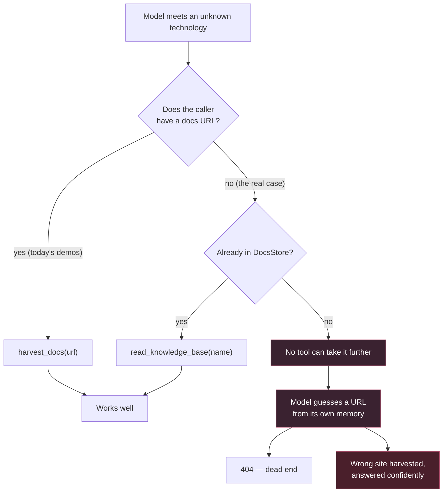
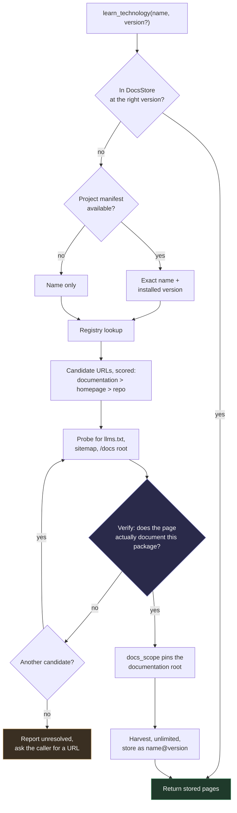
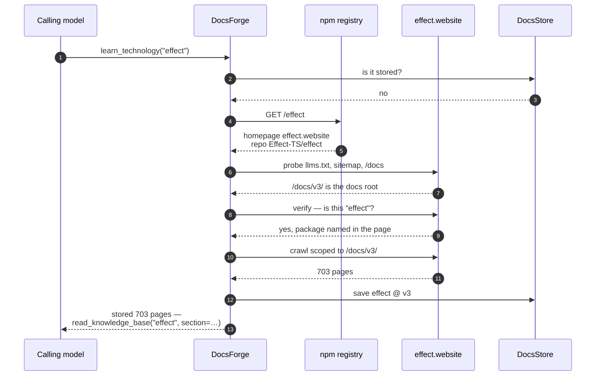

# Proposal: make DocsForge answerable by name, not by URL

**Status:** draft, nothing built yet
**Problem owner:** DocsForge as an embedded tool inside FlowIT

---

## 1. The problem in one sentence

DocsForge is meant to be the thing a model calls **when it hits a technology it
does not know** — but every ingestion tool it exposes requires the caller to
already supply the documentation URL, which is knowledge the calling model does
not have and cannot reliably invent.

### Evidence, from the current tool surface

| Tool | Takes | Can a model call it knowing only a name? |
|---|---|---|
| `detect_source_type` | `url` | No |
| `fetch_docs` | `url`, … | No |
| `save_docs` | `url`, … | No |
| `harvest_docs` | `url`, `name`, `version`, … | No |
| `list_knowledge_base` | — | Yes |
| `read_knowledge_base` | `name`, `section`, `version` | **Yes** |

Two of six are name-addressable, and both are read paths. Every path that
*acquires* new documentation needs a URL.

The system prompt encodes the same assumption — it instructs the model to
*"call `harvest_docs` with any page of its docs"* — so the gap is baked in at
the prompt level as well as the signature level.

### What actually happens today

The bottom-left branch is the whole reason the product exists, and it is the
branch that currently terminates in a guess.

**The guess is worse than a failure.** A model inventing a docs URL is drawing
on exactly the stale training data DocsForge was built to bypass. And it does
not fail loudly — it can resolve to a real, wrong page and get harvested and
summarised with full confidence. This build has already produced that failure
once, when a host-wide crawl from an Effect docs page swallowed `/podcast` and
the model summarised a podcast feed as if it were the library.

---

## 2. What already works, and must not be rebuilt

Worth being explicit, because the fix is smaller than it looks:

- **Name → content** works today when the technology is already stored.
  `read_knowledge_base(name, section=…)` does ranked full-text lookup inside
  that technology and returns only the relevant pages.
- **URL → the right pages** works well. `detect_source` picks a strategy,
  `docs_scope` keeps a crawl inside the documentation root, versions are
  detected from the path and verified against what actually came back.
- **Storage** is three-level and versioned: `technology → version → page`,
  Postgres-backed with ranked search, file fallback.

Exactly one hop is missing: **name → URL.** Everything downstream of a URL is
already built and tested.

---

## 3. Proposal

Four additions, in value order. Only the second involves genuinely new
machinery; the rest are plumbing over things that already exist.

### A. Resolve a name to documentation URLs

A resolution chain that turns `"effect"` into a verified docs URL, tried
cheapest-first and stopping at the first candidate that verifies.

| # | Source | Gives | Cost | Notes |
|---|---|---|---|---|
| 1 | DocsStore | the answer | free | Already harvested; skip everything else |
| 2 | Project manifest | exact name **and installed version** | free | Strongest signal — see §C |
| 3 | Package registry | `documentation` / `homepage` / `repository` | one HTTP call, no key | See table below |
| 4 | Host convention probe | the docs root | 1–3 HEAD/GET | Reuses `detect_source` |
| 5 | Repository | README + `docs/` | one call | Existing `github` handler |
| 6 | Web search | anything | needs an API key | Last resort, opt-in |

Registry endpoints, all keyless:

| Ecosystem | Endpoint | Field to prefer |
|---|---|---|
| npm | `registry.npmjs.org/<pkg>` | `homepage`, `repository.url` |
| PyPI | `pypi.org/pypi/<pkg>/json` | `info.project_urls.Documentation`, then `Homepage` |
| crates.io | `crates.io/api/v1/crates/<name>` | `documentation`, `homepage` |
| Go | `pkg.go.dev/<module>` | the page itself is the docs |
| Packagist | `repo.packagist.org/p2/<vendor>/<pkg>.json` | `homepage` |

### B. Verify before harvesting — the important part

A resolver that is merely *usually* right recreates the guessing failure with
extra steps. So resolution must end in a cheap verification: **fetch the
candidate and confirm it actually documents the package that was asked for**
(package name present in title, headings, or a code block; repo link matching
the registry's).

Only a verified candidate is harvested. An unverified one is either demoted to
the next candidate or reported back honestly as unresolved. Reporting "I could
not find docs for X, give me a URL" is a *good* outcome — it is a loud failure
instead of a silent wrong answer.

### C. Read the project's manifest

Since DocsForge is embedded in FlowIT, it can be handed a project path.
`package.json`, `pyproject.toml`, `requirements.txt`, `go.mod`, `Cargo.toml`
give exact dependency names **and the versions actually installed**.

This is the only thing that solves version selection. A bare name genuinely
cannot tell you which docs the project needs — ask for `pydantic` today and you
get 2.11, while the project may be pinned to 1.10, and those two contradict
each other. The versioned store already exists to prevent exactly that
contradiction; without the manifest it is defeated at the lookup step.

Version matching would try, in order: exact (`1.10.13`) → major.minor (`1.10`)
→ major (`1`) → latest — and label the harvest with what was *actually*
retrieved, which the existing `_version_label` check already enforces.

### D. Two smaller gaps in the same area

- **Expose the ranked search as a tool.** The store already does ranked
  cross-technology full-text search with highlighted snippets, but it is wired
  only to `/api/library-search` for the web UI. A model that sees an unfamiliar
  snippet and does not know which library it belongs to currently cannot search
  for it.
- **Alias and normalise names.** `read_knowledge_base("Effect.ts")` does not
  find `effect`. Aliases should be recorded at harvest time from the registry
  name, import name, repo name and page titles, and matched on lookup.

---

## 4. How it would operate afterwards

Everything from `SCOPE` rightwards is code that already exists and is tested.

### A concrete run

### Proposed tool surface

| Tool | Signature | Purpose |
|---|---|---|
| `learn_technology` | `name`, `version?`, `ecosystem?` | **The headline.** Resolve → verify → harvest → store, in one call. |
| `find_docs` | `name`, `ecosystem?` | Resolve only. Returns scored candidates with evidence, harvests nothing. Cheap and inspectable. |
| `search_knowledge_base` | `query`, `technology?`, `version?` | Ranked search across everything stored. |
| `scan_project` | `path?` | Dependencies with versions, and which are already stored. |

`read_knowledge_base` gains alias matching. The existing six tools are
unchanged, so nothing that works today breaks.

The net effect: **"the AI needs a URL" becomes "the AI needs a package name"** —
and a package name is something it always has, because it is reading the
import statement that confused it in the first place.

---

## 5. Failure modes, and what happens in each

| Situation | Behaviour |
|---|---|
| Registry `homepage` points at a marketing page | Convention probe + `docs_scope` find the docs root; if not, verification fails and the next candidate is tried |
| Name exists in two ecosystems | `ecosystem` hint from the manifest disambiguates; otherwise return both candidates rather than silently picking |
| Nothing resolves | Report unresolved and ask for a URL — a loud failure, not a wrong answer |
| Docs are JS-rendered | Existing `js: true` path |
| Harvest takes minutes | `learn_technology` should stream progress or be backgroundable; a 703-page crawl is ~12 minutes |
| Private or internal package | Registry lookup will fail; manifest may still carry a `repository` URL |

---

## 6. Risks

- **Wrong-library resolution** is the one that matters, because it fails
  quietly. Mitigated by the verification step, by scoring candidates rather
  than taking the first, and by returning evidence the caller can inspect.
- **Registry rate limits** — keyless but not unlimited; resolutions and
  negative results should be cached.
- **Network egress** from inside FlowIT may need to be allowlisted per host.
- **Scope creep into a search engine.** Step 6 (web search) is deliberately
  last, opt-in and key-gated; steps 1–5 need no third-party service.

---

## 7. Suggested phasing

| Phase | Scope | Network | Value |
|---|---|---|---|
| 1 | `search_knowledge_base` + name aliases | none | Immediate; purely local |
| 2 | Registry resolver + verification + `find_docs` | registries | Closes the missing hop |
| 3 | `learn_technology` one-call path | — | Makes it usable by a model in one step |
| 4 | `scan_project` + version matching | none | Solves version selection |
| 5 | Web-search fallback | key required | Long tail only |

Phase 1 is worth doing regardless — it needs no network and no new
dependencies.

---

## 8. Open questions

1. Can FlowIT hand DocsForge a **project path**? If yes, phase 4 jumps ahead of
   phase 2 in value, because it supplies names *and* versions for free.
2. Should `learn_technology` **block** for a full harvest, or return
   immediately and let the caller poll? A 703-page crawl is minutes long.
3. Which ecosystems matter first? npm and PyPI cover most of it; Go, Rust and
   PHP are more work for less return.
4. Is a web-search fallback acceptable at all, or should unresolved always mean
   "ask the caller for a URL"?
5. Should resolution results be **cached in the store** as first-class rows, so
   a resolved name → URL mapping survives restarts and is inspectable?
