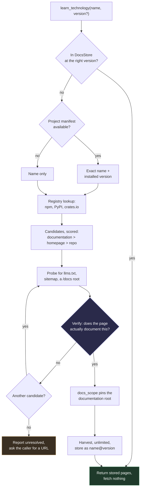
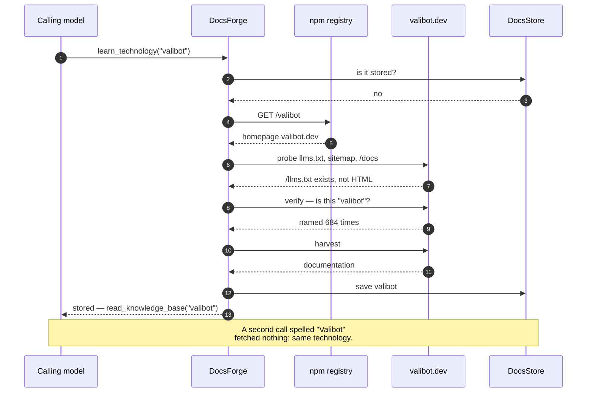
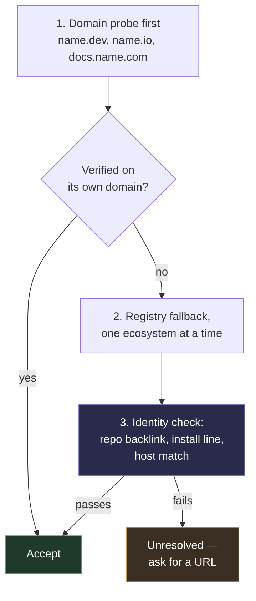

# Proposal: make DocsForge answerable by name, not by URL

**Status:** phases 1–4 **shipped** (PR #15). Phase 5 open, and redirected — see §5.
**Scope:** DocsForge as a **standalone MCP server**, open to any caller.
**Measured results:** [AUDIT.md](AUDIT.md)

> **Revision, 17 Aug 2026.** This document was first written with DocsForge
> framed as a component inside FlowIT. That framing was wrong and has been
> removed. DocsForge is a general-purpose MCP server whose one goal is to let
> **any** AI model understand **any** technology it was not trained on, by
> finding that technology's documentation on the internet, harvesting it, and
> storing it in DocsStore. FlowIT is one future consumer among others; building
> it standalone first is what keeps it uncorrupted by any single consumer's
> assumptions. Everything below is written for a model that installed DocsForge
> and knows nothing else about it.

---

## 1. The problem in one sentence

DocsForge is meant to be the thing a model calls **when it hits a technology it
does not know** — but every ingestion tool it exposed required the caller to
already supply the documentation URL, which is knowledge the calling model does
not have and cannot reliably invent.

### The tool surface as it was

| Tool | Takes | Callable knowing only a name? |
|---|---|---|
| `detect_source_type` | `url` | No |
| `fetch_docs` | `url`, … | No |
| `save_docs` | `url`, … | No |
| `harvest_docs` | `url`, `name`, `version`, … | No |
| `list_knowledge_base` | — | Yes |
| `read_knowledge_base` | `name`, `section`, `version` | **Yes** |

Two of six were name-addressable, and both were read paths. Every path that
*acquired* new documentation needed a URL. The system prompt encoded the same
assumption — it told the model to *"call `harvest_docs` with any page of its
docs"* — so the gap was baked in at the prompt level as well as the signature
level.

### What used to happen


The bottom-left branch is the whole reason the product exists, and it was the
branch that terminated in a guess.

**The guess is worse than a failure.** A model inventing a docs URL is drawing
on exactly the stale training data DocsForge exists to bypass, and it does not
fail loudly — it can resolve to a real, wrong page and get harvested and
summarised with full confidence. This build produced that failure once already,
when a host-wide crawl from an Effect docs page swallowed `/podcast` and the
model summarised a podcast feed as if it were the library.

Hold on to that sentence. §4 is about the same failure returning in a new place.

---

## 2. What shipped

Four tools, two new modules, and one structural change. All merged in PR #15.

| Tool | Signature | Status |
|---|---|---|
| `learn_technology` | `name`, `version?`, `ecosystem?`, `max_pages?`, `js?` | ✅ resolve → verify → harvest → store, one call |
| `find_docs` | `name`, `ecosystem?` | ✅ resolve only, returns scored candidates with evidence |
| `search_knowledge_base` | `query`, `technology?`, `version?`, `limit?` | ✅ ranked full-text across everything stored |
| `scan_project` | `path?`, `unknown_only?` | ✅ dependencies with versions, and which are stored |

- **`resolver.py`** (417 lines) — registries → convention probe → verification.
- **`manifests.py`** (226 lines) — `package.json`, `pyproject.toml` (PEP 621 and
  Poetry), `requirements.txt`, `Cargo.toml`, `go.mod`. No network, nothing
  evaluated.
- **Name normalisation** — `Effect.ts`, `effect-ts` and `effect` all resolve to
  the same stored technology, and `learn_technology` files under the canonical
  form so two spellings cannot become two copies.
- **The MCP surface is now generated** from `forge_tools.TOOLS` rather than
  restated by hand. It had already drifted: four tools existed in the library
  and were absent over MCP, and `max_pages` was capped at 200 in the MCP copy
  while the harvester treats `0` as unlimited — so no MCP client could request
  a full harvest. Twelve tests hold the two together.

The six original tools are unchanged. 306 tests, 284 passing, 22 skipped.

**The headline claim now holds:** *"the AI needs a URL"* has become *"the AI
needs a package name"* — and a package name is something it always has, because
it is reading the import statement that confused it.

---

## 3. How it operates now



### A real run, measured

Not an illustration — this is `learn_technology("valibot")` as it actually
executed, start to finish, in four seconds:



Everything from the probe rightwards is code that existed before this work and
is well tested. The new part is the two hops that get there.

---

## 4. What the audit found — and why phase 5 changed

The resolver works. **It is also wrong about three technologies in eight, and it
does not know it.** Live, today:

| Name | Resolved to | Verdict |
|---|---|---|
| `fastapi` | `fastapi.tiangolo.com/` | ✅ |
| `vitest` | `vitest.dev/llms.txt` | ✅ |
| `deno` | `deno.com/docs` | ✅ |
| `astro` | `astro.build` | ⚠️ marketing page; the real docs root was found, then rejected |
| `htmx` | `docs.rs/htmx` | ❌ a Rust crate |
| `kubernetes` | `github.com/kubernetes-client/python` | ❌ the client library, not the platform |
| `terraform` | `github.com/sintaxi/terraform#readme` | ❌ an unrelated project |
| `cloudflare workers` | unresolved | ⚠️ honest failure |

**All three wrong answers were marked `verified: true`.**

That is the whole finding. §1 argued that a resolver which is merely *usually*
right recreates the guessing bug with extra steps, and that verification is what
prevents it. Verification shipped — and it does not do that job. It counts how
many times the name appears in the page, and a page about *any* project called
`terraform` says "terraform" constantly. Mention-counting measures **topic, not
identity**.

There is a clear pattern in the failures: **every wrong answer came through a
registry, and two of three landed on a code forge. Every correct answer came
from the project's own domain.** Registries answer "what package is called
this", which is not the question being asked. This proposal's §3 ordered the
chain registries-first because registries are cheap and structured. That was the
wrong instinct, and the data says so.

### A second, unrelated finding worth more than all of the above

Resolution is not the only place DocsForge overstates its confidence. Seven
stored technologies contain an **`llms.txt` index** — a short list of links —
rather than documentation, because the `llms.txt` convention has two shapes and
the harvester treats them identically. Every one is recorded `complete: True`.

```
ai-sdk   stored 2,216 chars   ·   ai-sdk.dev/llms-full.txt holds 5,736,951
hono     stored 5,649 chars   ·   hono.dev/llms-full.txt   holds   368,654
svelte   stored 1,673 chars   ·   svelte.dev/llms-full.txt exists
```

The stored Hono file says, in plain English, *"[Full
Docs](https://hono.dev/llms-full.txt) Full documentation of Hono."* The answer
is named inside the file that was stored instead of it. Following that link is
a few lines of code and recovers millions of characters of documentation from
technologies DocsForge already thinks it has.

Full detail — including the empty-page probe bug that cost the correct Astro
answer, and the forge guard that lets `gist.github.com` through — is in
[AUDIT.md](AUDIT.md).

---

## 5. Remaining work, in order



| # | Work | Cost | Why |
|---|---|---|---|
| 0 | **Follow `llms-full.txt`** when a harvested `llms.txt` names one | tiny | Seven stored technologies hold a table of contents, not documentation. `ai-sdk` stored 2,216 chars; the file it names holds **5,736,951**. All marked `complete` |
| 1 | **Invert the spine** — probe the domain before asking a registry | small | Every correct answer came this way; every wrong one came through a registry |
| 2 | **Replace mention-counting with identity checks** | medium | This is what makes resolution safe rather than usually-right |
| 3 | **A live accuracy fixture** — known name → docs pairs, asserted against real resolution | small | Without it, 1 and 2 cannot be shown to have worked. The resolver's 23 tests all stub the fetcher, so every failure in §4 passes them |
| 4 | **Fix `latest`** — newest version, not newest harvest | small | `read_knowledge_base("pydantic")` returns **1.10** today, because 1.10 was harvested after 2.11 |
| 5 | **Content floor on probes; suffix-match the forge guard** | tiny | Both currently cost correct answers |
| 6 | **Make `learn_technology` non-blocking** | medium | 703 pages is ~12 minutes; MCP clients time out first |
| 7 | **Run the Postgres suite in CI** | small | All 22 skipped tests are Postgres — the production store is untested by default |
| 8 | **Then** consider web search | needs a key | See below |

**On web search.** It was phase 5 in the original plan, and it is the one item
here that costs every user an API key — which matters more for a standalone
server people install than it would for something embedded in one product. A
server that works the moment it is installed gets used; one that needs
configuration first often does not. It is also the wrong fix for §4: search
would feed *more* candidates into a verifier that cannot tell two projects
apart, which produces wrong answers from a larger pool rather than fewer wrong
answers. Items 1–3 should land first, and then search can be judged on the
problem it actually solves — the long tail of multi-word names like `cloudflare
workers`, which no registry can reach.

**Recommendation: keyless first.** Domain probe, plus a small curated index for
the giants that have no package at all, plus registries as fallback. Revisit
search once the verifier can be trusted.

---

## 6. Failure modes

| Situation | Behaviour |
|---|---|
| The site publishes an `llms.txt` index, not a full dump | The index is stored as the documentation and marked complete. **AUDIT F9** |
| Registry homepage is a marketing page | Probe + `docs_scope` look for the docs root — but see AUDIT F3: an empty redirect stub currently beats the real root |
| Name exists in two ecosystems | Candidates from all registries are pooled and ranked by confidence. **This is AUDIT F2** — `htmx` loses to a Rust crate this way |
| Two projects share a name | Verification passes both. **This is AUDIT F1**, the one that matters |
| Nothing resolves | Reported as unresolved with the candidates that were tried — a loud failure, working as designed |
| Docs are JS-rendered | Existing `js: true` path |
| Harvest takes minutes | Still blocks. AUDIT F7 |
| Private or internal package | No registry has it; pass the URL to `harvest_docs` directly |

---

## 7. Risks

- **Wrong-library resolution** — no longer a risk, a measured defect. Three in
  eight. Items 1–3 above are the response.
- **Registry rate limits** — keyless but not unlimited. Resolutions and negative
  results should be cached; they are not yet.
- **Scope creep into a search engine** — still the right thing to resist, and
  now for a second reason: search cannot fix a verifier that cannot distinguish
  projects.
- **Trust asymmetry** — a wrong answer stamped `verified` is worse than no
  answer, because the caller has been given a reason to stop checking. This is
  the risk that governs the ordering in §5.

---

## 8. Open questions

1. **Web search: in or out?** Recommendation above is keyless-first. Open.
2. **Should `learn_technology` block?** No — but the shape of the alternative
   (return a handle and let the caller poll, or stream progress) is undecided.
3. **Should resolutions be cached in the store** as first-class rows, so a
   resolved name → URL mapping survives restarts and is inspectable? Would also
   address the rate-limit risk.
4. **Which ecosystems next?** npm, PyPI and crates.io are wired. Go and Packagist
   are more work for less return, and after §4 the ecosystem question looks less
   important than the domain-probe question.

### Answered since the first draft

- ~~Can the caller hand DocsForge a project path?~~ Yes — `scan_project` ships
  and reads five manifest formats.
- ~~Should the ranked search be exposed as a tool?~~ Done —
  `search_knowledge_base`.
- ~~Will aliasing work?~~ Yes — `Effect.ts` finds `effect`, and a second harvest
  under a different spelling fetches nothing.
