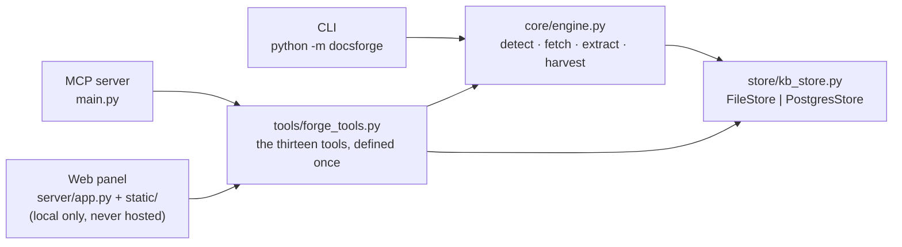
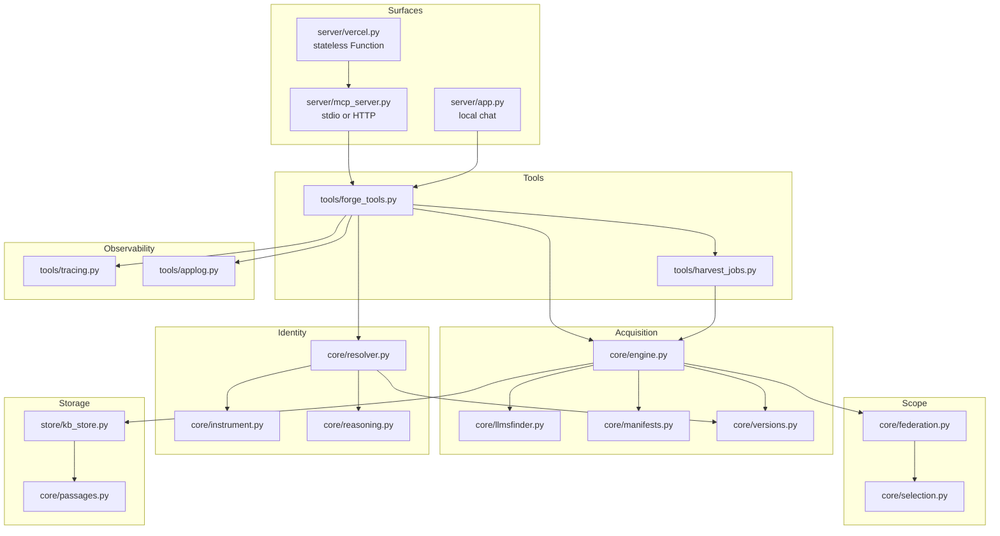
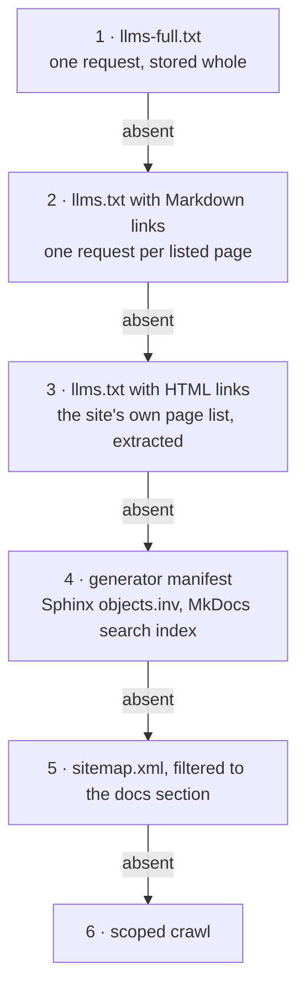
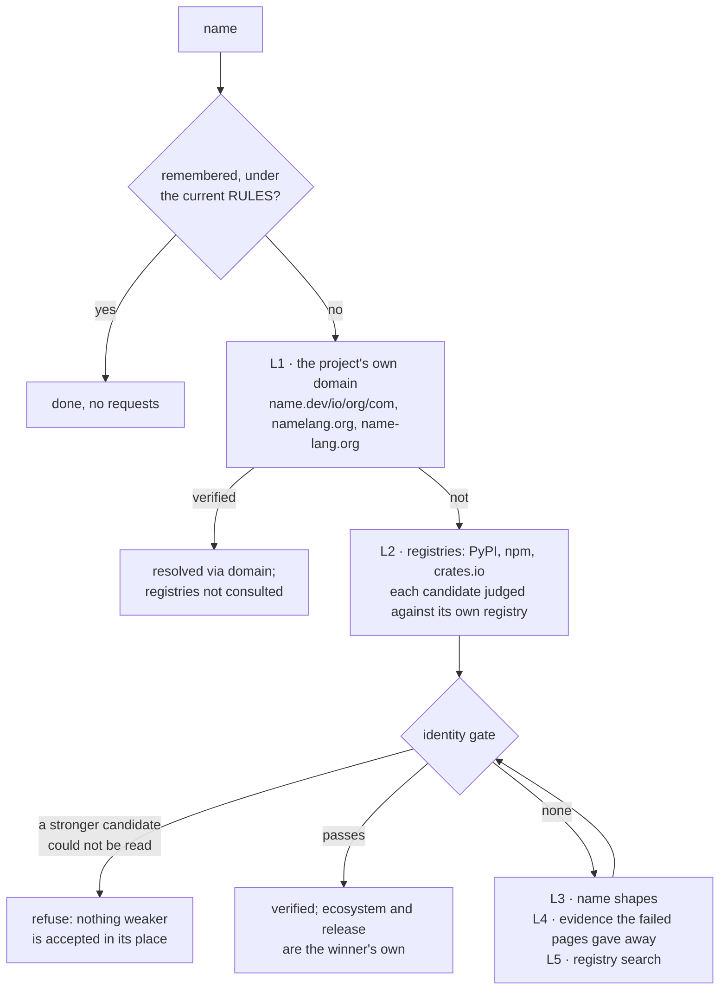
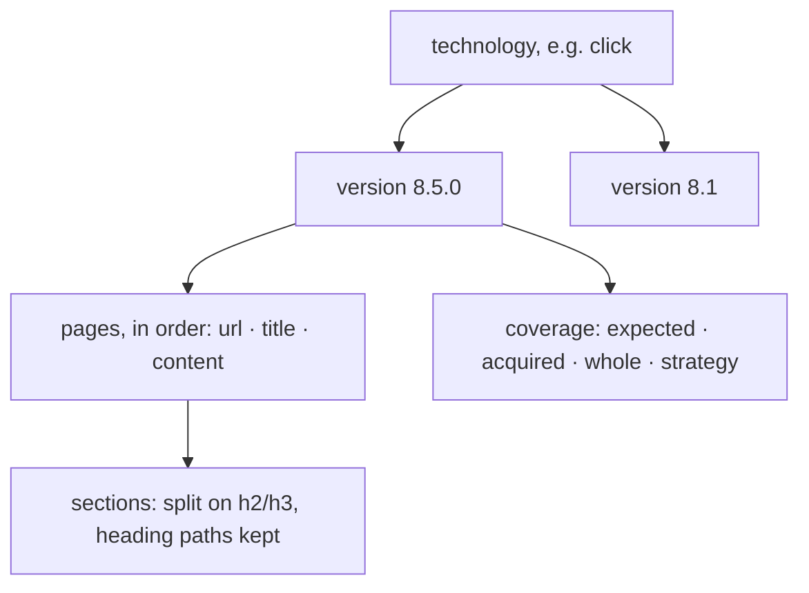
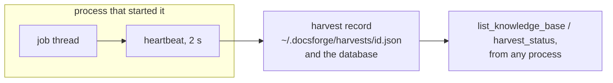

# Architecture

Recorded from the build, not from intention. Where the code and this file
disagree, the code is right and this file is stale.

Written on 2026-09-21 against 1,076 passing offline tests (61 skipped behind
opt-in gates: live network, a throwaway Postgres, browser rendering) and the
live benchmark suite in `scripts/benchmark/` (76 cases, published as
`benchmarks/bench-N/`).

---

## 1. One engine, three surfaces

The extraction engine is a library. Nothing in it knows whether a CLI, an MCP
client or a browser is asking, which is what keeps the three from drifting
apart: an MCP client and the chat panel return byte-identical results because
they call the same function with the same arguments.



`tools/forge_tools.py` is the seam. It owns argument shaping, the trace
wrapper, and the human-readable result strings; `core/engine.py` owns the web
and knows nothing about tools. `server/mcp_server.py` *generates* the MCP
surface from `forge_tools.TOOLS` — a JSON schema becomes a typed signature —
so the two cannot drift, and the benchmark's `surface_matches_checkout` case
confirms live that they have not.

---

## 2. Module map

Everything is one package, `docsforge/`, with a subpackage per
responsibility. `main.py` is the only script at the root: it starts the MCP
server, and being at the root is what makes it launchable by path from any
MCP client's config.

```
main.py                      python main.py [--http|--stdio]   -> the MCP server
docsforge/__main__.py        python -m docsforge <URL>          -> the CLI
docsforge/core/              acquisition, identity and scope
  engine.py                    Fetcher (the SSRF guard, redirects, 429), detection,
                               extraction, the acquisition ladder, the crawl
  resolver.py                  name -> where it documents itself; the identity gate
  llmsfinder.py                llms.txt shape, links, density
  manifests.py                 generator manifests (Sphinx objects.inv, MkDocs search index)
                               and project manifests (package.json, pyproject, ...)
  versions.py                  release ordering, "asked is a prefix of found"
  federation.py                a technology is several corpora; page kinds
  selection.py                 which corpora an intent takes; ask, never guess
  passages.py                  read-time relevance: sections, ranking
  reasoning.py                 optional model veto (DOCSFORGE_REASONING), off by default
  observation.py / instrument.py  what a page and a probe revealed; the crawl's plan
docsforge/store/kb_store.py  FileStore and PostgresStore behind one protocol
docsforge/tools/
  forge_tools.py               the tool layer: every tool, exactly once
  harvest_jobs.py              harvests that outlive the call: deadline, records, heartbeat
  tracing.py                   the nested execution trace a panel renders
  applog.py                    rotating JSONL request/tool/harvest log
docsforge/server/
  mcp_server.py                the MCP surface, the public site, /health, the bearer gate
  oauth.py                     an OAuth server whose login is the bearer token (for ChatGPT)
  vercel.py                    the same server as a stateless, ephemeral Vercel Function
  site/                        three self-contained public pages: /, /tools, /connect
  app.py + static/             the web chat and DocsStore browser -- local testing only
docsforge/providers/         one model backend per file, for the web chat
scripts/
  benchmark/                   the live suite: run.py, cases.py, live.py, offline.py
  measure*.py, smoke_*.py      the older harnesses and smoke drivers
tests/                       the offline suite
benchmarks/                  published benchmark runs, bench-1 onward
System Files/                this folder
```



---

## 3. Where it runs

Three shapes of process serve the same tools.

| | stdio | `--http` (long-lived) | Vercel |
|---|---|---|---|
| Started by | an MCP client, per turn | a person, or the Containerfile | the platform, per request |
| Store | files or `DOCSFORGE_DB` | files or `DOCSFORGE_DB` | Postgres, required |
| `/mcp` gate | none (pipes) | bearer token; refused on a non-loopback bind without one | bearer token, required |
| A harvest past the deadline | continues; the process waits for it before exiting | continues in the background | **discarded**, and the answer says so |
| Session state | per process | per process | none: every request carries everything |

**Hosted** is `docsforge/server/vercel.py`: the site at `/`, `/tools`,
`/connect`, `/health` for the platform, `/mcp` behind `DOCSFORGE_MCP_TOKEN`
(with an OAuth layer whose login *is* that token, so a client that cannot
send a bearer header — ChatGPT — can still get in). The corpus lives in an
Aiven PostgreSQL. Only `/tmp` is writable, so the caches DocsForge keeps on
disk go there, and harvest records go to the database as well, because two
requests are not promised the same instance.

**Offline** is `scripts/benchmark/offline.py`: `python main.py --http` on
loopback against a local `docsforge` database, with every variable DocsForge
reads set to an offline value before the process starts. It is the shape the
benchmarks run in, and the shape a person uses to harvest something large:
nothing cuts a harvest short there.

---

## 4. A tool call, end to end

```mermaid
sequenceDiagram
  participant C as MCP client
  participant S as mcp_server
  participant T as forge_tools.run_tool_checked
  participant E as engine / resolver
  participant K as store

  C->>S: tools/call learn_technology(name)
  S->>T: run on a worker thread
  T->>T: open a trace; sanitise args
  T->>E: resolve(name)
  E-->>T: Resolution (best, candidates, note)
  T->>E: harvest(best.url) -- on a job thread
  E->>K: sink.add(page) per page, durable as it goes
  Note over T: deadline (25 s) reached
  T-->>S: "still running, harvest id click-1"
  S-->>C: text result
  E->>K: settle(complete, expected, version)
  Note over K: job record: done
```

`run_tool_checked` wraps every tool in one root trace stage recording the
arguments (sanitised) and the returned text (bounded), and turns a
`ForgeError` into an `isError` result whose text a model can act on. Read
tools (`list_`, `read_`, `search_knowledge_base`, `harvest_status`,
`scan_project`) run inside one store session — one connection for the call,
not one per operation, which mattered the day ten concurrent searches were
forty connections against a plan allowing twenty. The harvesting tools are
deliberately *not* pooled: they spend their call fetching pages, and holding a
connection open across that is the problem, not a smaller version of it.

---

## 5. The Fetcher: every request through one door

`engine.Fetcher.get` is the only place an HTTP request leaves the package, and
it does four things on every one:

1. **Guard the URL**: scheme, host, and the address the host resolves to —
   private, loopback, link-local, reserved, multicast and unspecified ranges
   are refused, NAT64-mapped addresses are unwrapped first, and every
   `inet_aton` spelling (`2130706433`, `0x7f000001`, `0177.0.0.1`, `127.1`)
   is read as the address it is, without asking the platform's resolver.
2. **Follow redirects itself**, one hop at a time, guarding each target.
   `requests` used to follow them alone, and a `302 Location:
   http://169.254.169.254/` walked past the guard that refused the same
   address typed directly (`Evaluation` §2.1, fixed 2026-09-17).
3. **Honour a 429**: `Retry-After` is waited for, bounded by 30 s and two
   retries; a 429 that names no wait gets five seconds.
4. **Report where it landed**: `html_at` returns `(html, landed_url)`, and a
   crawl resolves relative links against that, or a declared `<base href>`.
   Resolving against the normalised spelling it had asked for turned
   `quickstart/` under `/en/stable` into `/en/quickstart`, 38 times.

An HTTP failure is an `HTTPStatusError` carrying its status, so a caller can
tell a 404 (the page is not there) from a 429 (the site said not now).

---

## 6. The acquisition ladder

Tried in order, stopping at the first rung that answers. The claim is that
more laps never mean a lower bar.



**A file the site published about itself outranks anything inferred about
it.** A sitemap is a hint addressed to crawlers; `llms.txt` is a statement
addressed to us. **An index is not documentation**: shape is classified by
link density before anything is stored, and an index of 229 links is a table
of contents, not a corpus.

**The request decides the pathway, not the file.** `llms.txt` describes the
current release. Asked for a named release, the harvest checks whether the
file declares one and whether it matches, narrows to the links filed under
that release when it does not, and ignores the file when it cannot show it
documents the release asked for.

**Every rung pays the same politeness**: a per-host delay, a per-host
concurrency cap, and — new this week — a stop after three 429s in a row. A
harvest the site stopped reports the pages it did not fetch as *refused by
the site*, a different fact from *reached and unreadable*, and the corpus is
`INCOMPLETE` for that stated reason rather than `COVERAGE UNKNOWN`.

### Coverage is three separate claims

| Claim | Means |
|---|---|
| `expected` | unique actionable pages the manifest or sitemap lists |
| `acquired` | how many of those came back |
| `whole` | `acquired == expected`; `False` for a partial corpus; `None` when nothing established a denominator (a drained crawl frontier) |

`expected` is measured against what the site says exists, never against the
slice a page limit left behind. `unextractable` (reached, nothing on it read
like documentation) and `refused` (asked for, HTTP 429) are listed by URL in
the harvest's coverage note, because a hole nobody is told about is
indistinguishable from a page that never existed.

---

## 7. Name resolution and the identity gate

The hard part is not finding a candidate. It is refusing a plausible wrong
one: a harvest of the wrong project, stamped `verified`, is worse than no
harvest, because the caller has been given a reason to stop checking.



The whole ladder is capped at 40 requests. **Strong signals** identify a
project rather than describe one: `own-domain`, `docs-host`, `install:`,
`repo-backlink`, `registry-agreement`, `repo-identity`. Mention counts are
corroboration, never proof.

Rules the gate learned the hard way, each after being caught live:

- **A code host is nobody's own domain** (`mojo.dev` → a Java library called
  procrastination).
- **A language owns its `lang` domain** (`zig`, `nim`).
- **A first-come `<name>.github.io` and a country-code mirror do not outrank
  the project's own domain** (`tensorflow`, `pytorch`).
- **A candidate is judged against its own registry**: `click` on PyPI used to
  be tested against npm's ecosystem and npm's repository, and stored under
  npm's version, `0.1.0` (fixed 2026-09-17; `System Files/Issues.md` R6).
- **A candidate that could not be read blocks anything weaker.** With
  click.palletsprojects.com answering 429, `click` resolved to a Kubernetes
  CLI's wiki and `requests` to a Rust crate — both verified, because both do
  document a project of that name. A registry-nominated candidate whose fetch
  failed for a reason that says nothing about it (429, 5xx, no answer) is
  *unexamined*, and the ladder stops there with a refusal that is not cached
  (fixed 2026-09-20).
- **Evidence links are anchors only, decoded, and judged by their own
  words**: `fonts.googleapis.com` is not an API reference.

### The cache is evidence, and evidence goes stale

A resolution is filed for 30 days, a refusal for 7, both stamped with the
`RULES` revision that decided them and discarded on recall if the stamp no
longer matches. Two things are never filed: a refusal reached without reading
the candidates (the network talking, not the name), and a refusal for want of
examination (a rate limit talking).

---

## 8. Storage



Two versions of one library are kept side by side, because they contradict
each other. `core/versions.py` orders labels so "latest" means newest rather
than most recently fetched; a release number outranks a harvest date, and a
date only appears when a harvest failed to find a number.

| | `FileStore` | `PostgresStore` |
|---|---|---|
| When | default; `DOCSFORGE_DB` unset or unreachable (and it says so) | `DOCSFORGE_DB` set |
| Search | substring, then any-term | full-text, ranked; `page.search` over the first 300,000 characters, `section.search` over the rest |
| Durability | `.partial` file until settle | a row per page, written as fetched |

Both stores search for every word first and fall back to any of them. The
fallback used to come back dressed as a match; the tool's header now names
the words no returned passage contains.

---

## 9. A harvest outlives the call that started it

A tool call returns at the deadline (25 s) with a harvest id; the harvest
runs on in the process that started it. Its status is *published*, not held:



This is not a job queue. Nothing is resumed from a record; a harvest still
dies with its process, and a record whose heartbeat stopped is reported
**stalled**, never running. Hosted, the process is the request, so a harvest
past the deadline is *lost* and the answer says so; a long harvest is done
from a long-lived DocsForge pointed at the same database, and is readable
hosted at once. Offline, `DOCSFORGE_HARVEST_LINGER=0` makes the process wait
for every harvest it started before exiting.

---

## 10. Observability

Two records for two readers. `tools/tracing.py` is a nested, incrementally
emitted event log — every tool call is a root stage; resolution, harvesting
and each page are stages beneath it; events are keyed by id so 230 progress
ticks are one row counting up. `tools/applog.py` is rotating JSONL at
`logs/docsforge.log` (offline: `offline/logs/`): one line per request, tool
call, trace event, harvest transition and error. Neither fabricates a
percentage where the backend has no denominator.

---

## 11. Boundaries

- Fetches to private, loopback, link-local and reserved addresses are
  refused, in every spelling, at every redirect hop, and inside the browser
  when rendering (`page.route` interception).
- `save_docs` cannot write outside `DOCSFORGE_OUT_ROOT`.
- Tool results are capped (`DOCSFORGE_MAX_CHARS`, 200,000 by default) with a
  marker naming what was omitted; storage is unbounded.
- Deletion is opt-in (`DOCSFORGE_ALLOW_DELETE`); offline turns it on because
  the store is disposable.
- Rendered Markdown in the local panel is sanitised with `nh3`.

## 12. What this architecture refuses

- **Guessing a URL for a name it could not confirm**, and accepting a weaker
  candidate for one it could not read.
- **Reporting coverage it did not measure.** `complete`, `incomplete`,
  `unknown` and now `refused` are distinct, and none is rendered as success.
- **Restructuring what a publisher wrote.** Relevance is applied at read
  time; ingestion never reshapes what was published.
- **Letting one dead page end a run** — or one 429 pretend the page was empty.
