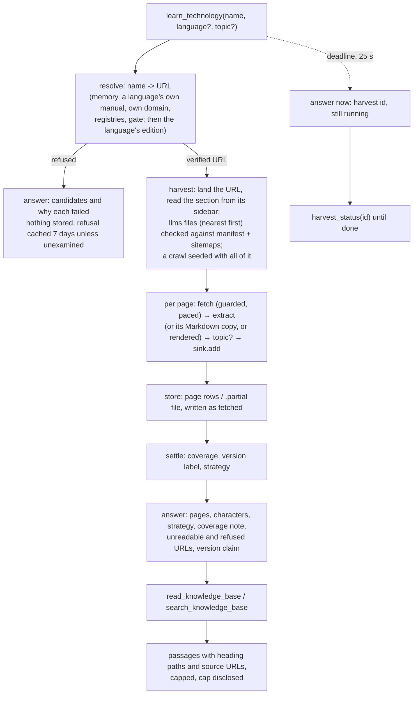

# Workflow

How data flows through DocsForge, and how the system is operated: what a
request becomes, where each byte goes, what is written where, and the
commands and variables that drive it. `Architecture.md` names the parts;
this follows one page from a name to an answer, then describes running the
thing.

---

## 1. The flow of one technology, from name to answer



### 1.1 Resolution

Input: a name as the caller saw it written (`click`, `@tanstack/react-query`,
`Effect.ts`). Output: a `Resolution` — every candidate with its source,
confidence, signals and reason; `best` when one verified; `note` otherwise.

1. **Memory.** `~/.docsforge/resolutions.json` (offline: `offline/resolutions.json`;
   hosted: `/tmp`, per instance). A hit costs zero requests. Entries carry
   the `RULES` revision that decided them and are discarded if it changed,
   and each language asked for has its own entry (`langgraph@javascript`).
1b. **A language's own manual.** When the name is a language or runtime (`go`,
   `python`, `node`) and no registry was named: `languages.OFFICIAL_DOCS`,
   through the gate like any candidate.
2. **Own domain.** `name.dev/.io/.org/.com`, `namelang.org`, `name-lang.org`;
   each probed for `llms.txt`. Verified here, registries are not consulted:
   owning the name is the stronger claim.
3. **Registries.** PyPI, npm, crates.io, each asked for the name; each
   candidate carries the registry that nominated it and is judged against
   *that* registry's facts (its install line, its repository). A homepage
   that does not look like docs gets one round of docs-root probing beneath it.
4. **The gate.** Every candidate is fetched (once, through `Fetcher.get`) and
   read for identity signals. `best_verified` compares all that passed.
   Before it is accepted: if a registry-nominated candidate that *outranks*
   it could not be read for a transient reason, the resolution stops with a
   refusal that names it and is not cached.
5. **The tail** (only when nothing passed and nothing blocked): name shapes
   for multi-word names, evidence the failed pages gave away (a repository's
   declared homepage, outbound documentation-looking anchors, a canonical
   URL), then registry search — only the registry named, if one was. All
   capped at 40 requests in total.
6. **After the gate.** A winning GitHub repository gives way to the site it
   declares as its homepage, if that passes. With `language=`, the answer is
   switched to that language's edition when the site publishes one beside it
   (segment, prefix, host label, or the front page's language section),
   judged by the page's own code; failing that, the language's registry is
   resolved and switched the same way; failing that, the note says so.

What is written: the memory file (a success for 30 days, a real refusal for
7), the `ResolveState` (in memory only), and a trace stage per lap.

### 1.2 Harvest

Input: a verified URL, an optional version, an intent, a page cap (0 =
none). Output: a stored corpus and its coverage.

0. **Land and bound.** The start URL is followed past redirects and redirect
   stubs, and the section is read from the landed page's own sidebar
   (`_resolve_section`) — widened only where the URL named no real subtree,
   never across a release. docsify sites turn off here: their `_sidebar.md`
   lists the Markdown files, read directly.
1. **Detect** what the URL is: `llms-full.txt`, `llms.txt` (the section's own
   directory first, then each above it, then the origin; a fuller dump
   preferred), OpenAPI, sitemap, GitHub, raw text, HTML.
2. **Enumerate.** A dump is cut into the pages it names (`Source:`, `URL:`, a
   heading that links to the page); an `llms.txt` index's pages are fetched;
   then both are checked against the generator manifest and every sitemap
   (the section's own first, reading budgeted) and against the links on the
   pages delivered, and whatever those name in the section is fetched too.
   With no published file: the manifest and sitemaps together, filtered to
   the section, one language and one release, seed a crawl that also
   follows every in-section link; with no list at all, a crawl from the
   start page.
3. **Fetch and extract**, page by page, within a per-host delay (0.4 s) and
   concurrency cap (4), overlapping HTTP where the plan allows. Each page's
   relative links resolve against where it landed. Extraction flattens tabs,
   picks the main content container, strips chrome and permalinks, keeps
   code lines and fence languages, resolves links, converts to Markdown, and
   the crawl's plan re-derives every twelfth page which selector is working.
   A page with no readable HTML is taken from its declared Markdown copy, or
   rendered once if it ships the scripts to draw itself. With a `topic`, each
   page is judged at the sink, and only kept pages are followed.
4. **Store as it goes.** `sink.add(title, url, body)` per page — a row in
   Postgres, a line in a `.partial` file — so an interruption keeps what it
   had.
5. **Settle.** `expected`, `acquired`, `whole`, `strategy`, the version label
   (the URL's, the manifest's declaration, or the registry's release — and a
   note when the label is the request repeated back), and the coverage note:
   the page cap, unreadable pages, refused pages, other corpora seen and not
   taken; dead listings (404) and index pages, reported but not counted as
   gaps; and for a topic, the terms used and what was left out, by section.
   A language's edition is filed as `<name>-<language>` and a topic harvest
   as `<name>-<topic>`.

What is written: the store; a harvest record (`harvests/<id>.json`, and a
row in Postgres) updated on every phase change and every 2 s while running;
one JSONL line per transition; the trace.

### 1.3 Reading

`read_knowledge_base(name, version?, section?)` returns whole pages (or the
pages whose titles or text match `section`), the current release by default
(the version found as current, over any pinned by name),
capped at `DOCSFORGE_MAX_CHARS` with a header naming what was omitted.
`search_knowledge_base(query, technology?, kind?)` searches every stored page
— Postgres: full-text, every word then any word; files: substring then terms
— opens the best matching pages, splits them into sections and ranks the
sections against the query. The header says how many passages, over how
many pages, and which of the query's words none of them contains.

Nothing is written by a read except the JSONL line and the trace.

---

## 2. The flow of a request

```mermaid
sequenceDiagram
  participant Client
  participant Gate as BearerGate (HTTP only)
  participant SDK as MCP SDK (stateless on Vercel)
  participant Tool as run_tool_checked
  participant Log as applog / tracing

  Client->>Gate: POST /mcp, Authorization: Bearer …
  Gate-->>Client: 401 + WWW-Authenticate (bad or missing)
  Gate->>SDK: JSON-RPC tools/call
  SDK->>Tool: worker thread
  Tool->>Log: trace root stage; args sanitised
  Tool->>Tool: store().session() for read tools
  Tool-->>SDK: text, or ToolError(text)
  SDK-->>Client: result (isError set on a refusal)
  Tool->>Log: tool_call line: name, ok, ms, chars / error
```

Over stdio there is no gate — the pipes are the client's — and the process
is launched per turn, so `harvest_jobs.DETACHED` hands background harvests
to the long-lived server if one is configured and otherwise waits for them
before exiting.

---

## 3. Where every byte goes

| Data | Files (default) | Postgres (`DOCSFORGE_DB`) | Hosted (Vercel) | Offline |
|---|---|---|---|---|
| Pages, sections, coverage | `knowledge_base/<tech>/<version>.md` | tables `technology`, `version`, `page`, `section` | Aiven Postgres | local `docsforge` database |
| Harvest records | `~/.docsforge/harvests/*.json` | same, plus a row | `/tmp` + the database | `offline/harvests/` + the database |
| Resolution memory | `~/.docsforge/resolutions.json` | — | `/tmp/docsforge/resolutions.json` | `offline/resolutions.json` |
| Corpus selection memory | `~/.docsforge/selection.json` | — | `/tmp/…/selection.json` | `offline/selection.json` |
| `save_docs` output | `./docs_md/` | — | `/tmp/docsforge/out` | `offline/out/` |
| Logs | `logs/docsforge.log` (JSONL) | — | `/tmp/docsforge/logs` (lost with the instance) | `offline/logs/` (+ `server.log`) |

The hosted instance's `/tmp` is a cache: losing it costs a repeat lookup,
never a page.

---

## 4. Operating it

### 4.1 Locally, as a person

```
pipx install docsforge                # or: pip install -e . from a clone
python main.py                        # site + /mcp on http://127.0.0.1:8765, files as the store
DOCSFORGE_DB=postgresql://… python main.py    # the same on Postgres
python -m docsforge https://docs.x.dev --crawl # one-shot extraction to ./docs_md
claude mcp add docsforge -- python E:/DocsForge/main.py      # stdio, per turn
claude mcp add --transport http docsforge http://127.0.0.1:8765/mcp
```

### 4.2 Offline: the whole thing, isolated

```
python -m scripts.benchmark.offline           # the offline server, left up
python -m scripts.benchmark.offline --env     # every variable it will set, secrets masked
python -m scripts.benchmark.run --offline     # server + all 76 benchmark cases, writes allowed
python -m scripts.benchmark.run --offline --reset --publish   # a fresh DB and a published bench
```

The offline runner sets, before the server starts: `DOCSFORGE_DB` (local),
`DATABASE_URL` (empty), `DOCSFORGE_KB_ROOT`, `_LOG_DIR`, `_HARVEST_STATE`,
`_RESOLVE_CACHE`, `_SELECTION_POLICY`, `_OUT_ROOT` (all under `offline/`),
`DOCSFORGE_MCP_TOKEN` (empty: loopback), `DOCSFORGE_PUBLIC_URL` (empty),
`DOCSFORGE_HARVEST_DEADLINE` (25), `DOCSFORGE_HARVEST_LINGER` (0: wait for
every harvest), `DOCSFORGE_ALLOW_DELETE` (1), `DOCSFORGE_BUILD` (the HEAD
sha). `.env` is loaded by DocsForge on import but never overrides a variable
already set, which is what keeps the shared store out of every offline run.
Its own inputs are `DOCSFORGE_OFFLINE_*` (see `scripts/benchmark/README.md`).

### 4.3 Hosted

Configuration is the platform's environment, never a file: `DOCSFORGE_DB`
(required), `DOCSFORGE_MCP_TOKEN` (required; without it `/mcp` answers 503,
not open), `DOCSFORGE_HARVEST_DEADLINE` (under `vercel.json`'s
`maxDuration`), optionally `DOCSFORGE_PUBLIC_URL`. The entry point is
`docsforge/server/vercel.py`; `.vercelignore` keeps tests, scripts, benches,
these files and `.env` out of the bundle. A deploy is a push to `main`.
`list_knowledge_base` reports the build sha the instance was built from, and
the benchmark checks it is a commit the checkout knows.

### 4.4 Reading the records

- `harvest_status()` — every harvest in flight or recently ended, from any
  process that shares the record location or the database.
- `list_knowledge_base()` — what is stored, per version, with coverage flags,
  the build, and the store's capacity.
- `offline/logs/docsforge.log` — one JSON line per event; `grep '"kind": "harvest"'`
  is a harvest's timeline, `"kind": "tool_call"` is every call with its
  duration.
- `benchmarks/bench-N/results.json` — every benchmark answer's opening lines
  and timing.

### 4.5 Recovering

| Situation | What to do |
|---|---|
| A name resolved to the wrong project | `forget_resolution(name)`, then `learn_technology(name, refresh=true)` only if the stored copy is demonstrably wrong |
| A harvest stopped at a page cap | `learn_technology(name, refresh=true, max_pages=0)` from a long-lived server |
| The site rate-limited a harvest | wait; the coverage note names the refused pages; harvest again later |
| The hosted store looks empty | `/health` says `degraded` when the database could not be reached; the instance fell back to files on `/tmp` and says so in every listing |
| A benchmark case fails on a `resolve` or `detect` expectation | open the URL before opening the code — sites move (`pydantic.dev`, 2026) |

---

## 5. The flow of a change

1. Reproduce live (offline runner, or a read-only call to the hosted
   server) and read the answer, not the exit code.
2. Fix; write the regression test from what reality showed, naming the URL
   or count in its docstring.
3. `DOCSFORGE_DB="" DATABASE_URL="" pytest tests` — set empty, never popped,
   so `.env` cannot refill them.
4. `python -m scripts.benchmark.run --offline --reset` — the suite, whole
   harvest included, against the change.
5. Publish a bench when the build is one worth recording, and finish its
   *Issues faced* by hand.
6. `git` for everything; a pull request is a pushed branch and a compare URL.
